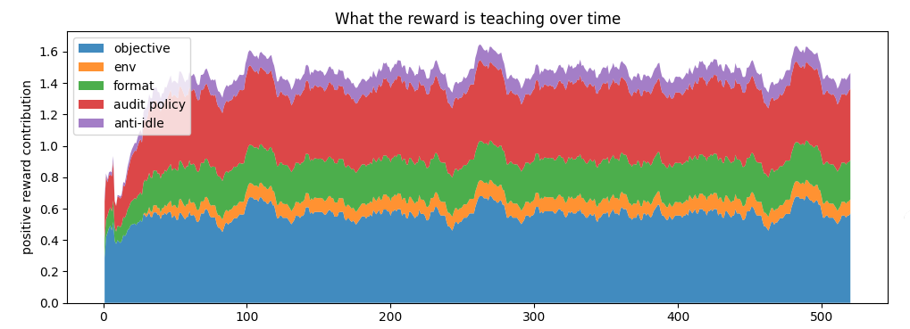
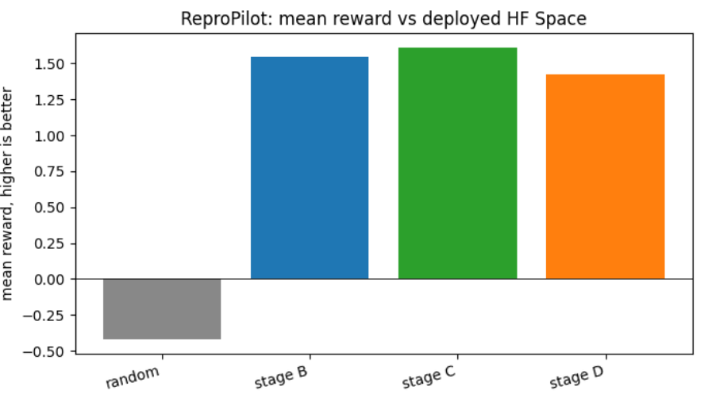
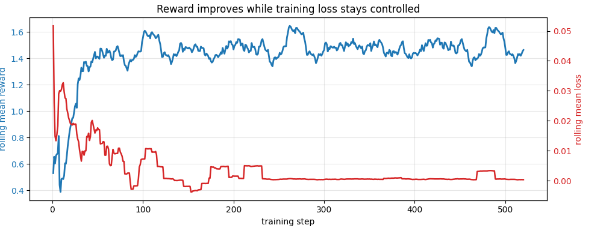
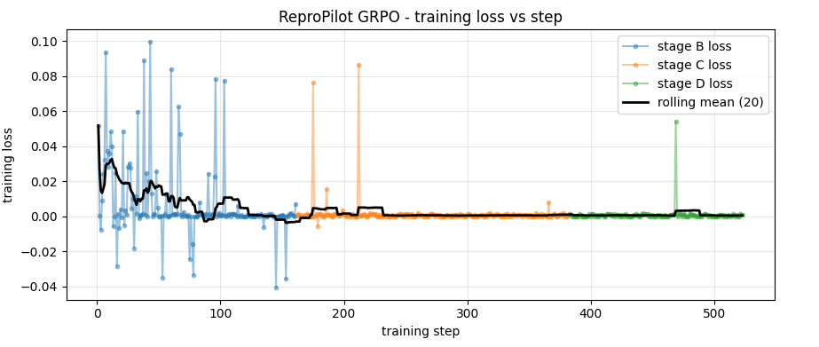
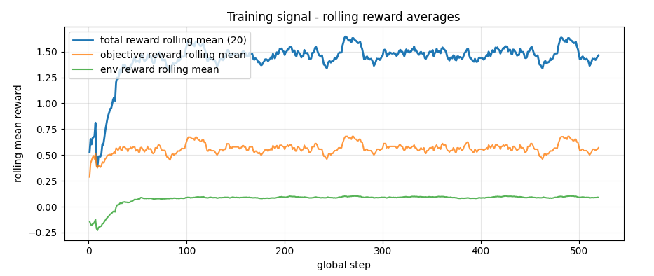
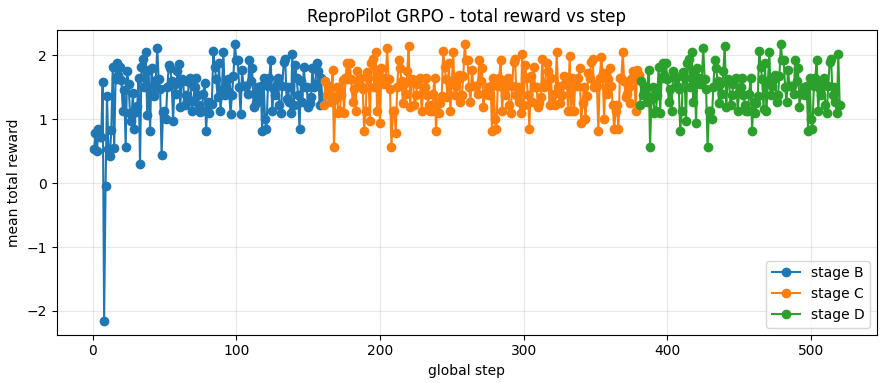
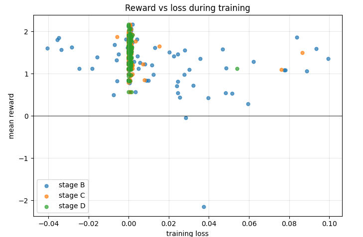

# ReproPilot

ReproPilot is an OpenEnv-compliant environment for training LLM agents on reproducibility investigation and professional research-workflow tasks. The agent audits research-paper claims against supplied artifacts, chooses structured JSON actions, gathers evidence, runs deterministic methodology checks, and submits a grounded verdict.

The goal is not to prove scientific truth from scratch. The goal is to train agents to stop guessing and instead perform disciplined, multi-step reproducibility audits over the evidence they can actually inspect.

## Why this matters

LLMs often produce plausible research and debugging narratives without doing the careful investigation that reproducibility work requires. In real reviews, the hard questions are operational:

- Does the claimed metric match the logs?
- Does the paper say test while the code uses validation?
- Was the test set used for hyperparameter search?
- Are baselines compared fairly?
- Is the claimed method actually implemented?
- Is a strong result supported by enough runs, seeds, and evidence?

ReproPilot targets that capability gap. It trains agents to inspect evidence, choose valid actions, avoid idle or reward-hacking behavior, and improve over long-running environment interactions.

## Hackathon Theme Fit

ReproPilot fits **Theme #3.1: Professional Tasks / World Modeling**. The agent interacts with a dynamic environment, maintains state across a multi-step audit, and must decide what evidence to inspect before issuing a final judgment.

It also exercises long-horizon planning: the agent has up to 12 steps to move from a paper claim to artifact inspection, methodology checks, evidence synthesis, and a calibrated verdict.

## Environment Overview

At reset, the agent receives a plain-text research audit briefing with the target claim, paper sections, artifact identifiers, available configs/logs/result tables, and validation checks already run. Each step accepts one structured `AgentAction` JSON object and returns a new observation, reward, done flag, and metadata containing scenario state, observed evidence, checker results, and reward breakdown.

The action space includes artifact inspection, search, composite audit actions, deterministic methodology checks, episode control, and final verdict submission. Success means submitting the right verdict and failure type with valid evidence after using relevant checks, while avoiding fabricated evidence, hidden gold access, repeated idle actions, and unsupported claims.

ReproPilot follows the OpenEnv reset / step / state pattern:

- `openenv.yaml` declares the environment metadata, tasks, runtime, port, and max steps.
- `server/repropilot_environment.py` implements the OpenEnv environment class.
- `server/app.py` exposes the OpenEnv HTTP/web interface through FastAPI.
- `pyproject.toml` depends on `openenv-core[core]>=0.2.3`; the committed lockfile resolves `openenv-core==0.2.3`.

Hugging Face Space deployment:

- [Hugging Face Space](TODO_ADD_HF_SPACE_URL)

## Current Scale

- 52 total scenarios
- 39 training scenarios
- 13 heldout scenarios
- 18 regression tests
- 29 legal JSON actions
- 12 deterministic audit checks

## Reward Design

The reward is interpretable and intentionally shaped around reproducibility work rather than surface-level answers.

- **Objective progress reward:** credits moving toward the correct verdict, correct failure type, valid evidence, and relevant checker usage.
- **Environment feedback reward:** gives dense step-level feedback for useful inspection, comparison, audit, planning, ranking, and synthesis actions.
- **Valid action / formatting reward:** rewards valid structured JSON actions and penalizes malformed or unsupported actions.
- **Audit-policy / evidence-seeking reward:** rewards inspecting the right artifacts, running deterministic checks, ranking evidence, and grounding the final verdict in observed evidence.
- **Anti-idle / anti-gaming reward:** penalizes repeated actions, `do_nothing`, hidden/gold-answer access attempts, fabricated evidence, premature verdicts, and timeout without a verdict.


**Figure: Reward component breakdown.** The reward combines objective progress, environment feedback, valid action formatting, audit-policy behavior, and anti-idle incentives so the agent is rewarded for reproducibility work rather than superficial answers.

## Training Setup

Training uses Hugging Face tooling with TRL GRPO, plus a small SFT warm-start for JSON/action routing. The active notebook is [notebooks/trainer.ipynb](notebooks/trainer.ipynb), designed for Google Colab with `!pip install` setup, an `unsloth/Qwen2.5-3B-Instruct` default model, LoRA adapter training, staged GRPO, and reward-component logging.

The training loop connects to the deployed Hugging Face Space environment rather than only training on a static dataset: the notebook calls `/reset` for a research audit briefing and `/step` to score model-generated JSON actions.

Training stages:

- **SFT warm-start:** teaches objective-to-action routing.
- **Stage B:** higher-temperature exploration.
- **Stage C:** lower-temperature refinement.
- **Stage D:** low-temperature stabilization.

Notebook outputs include reward logs, learning curves, reward component plots, final LoRA adapter artifacts, and a run manifest.

## Results


**Figure 1. Baseline vs trained reward.** The trained GRPO stages achieve much higher mean reward than the random baseline on the deployed Hugging Face Space.


**Figure 2. Reward and loss training progress.** Rolling reward improves quickly and remains high, while rolling mean loss stays controlled across training steps.


**Figure 3. Training loss curve.** GRPO training loss remains bounded across stages, providing the required loss evidence from a real training run.


**Figure 4. Training signal - rolling reward averages.** Total reward rises quickly and stabilizes, while objective and environment reward components improve during training.


**Figure 5. Total reward by step.** Rewards remain consistently positive across trained stages B, C, and D after the initial learning phase.

After training, the behavior changes from guessing to investigation. A random or untrained baseline often burns steps, repeats low-value actions, or submits unsupported verdicts. The trained policy more reliably inspects artifacts, runs the relevant deterministic checks, gathers evidence, and submits a verdict tied to observed evidence.

## Additional Diagnostics

<details>
<summary>Additional diagnostics</summary>


**Diagnostic: Reward vs loss.** Most later-stage samples cluster around low loss and positive reward, with early-stage outliers visible.

</details>

## How to Run

Install dependencies:

```bash
uv sync --extra dev
```

Run the OpenEnv server locally:

```bash
uv run server --port 8000
```

Open the local web interface:

```text
http://127.0.0.1:8000/web
```

Smoke-test the HTTP endpoints:

```bash
uv run python scripts/http_endpoint_smoke.py --local
```

Run a short local episode demo:

```bash
uv run python scripts/demo_repropilot.py
```

Run tests:

```bash
uv run --extra dev pytest -q
```

Run heldout evaluation from Python:

```python
from baselines.smart_policy import smart_action
from evaluation.evaluate_policy import evaluate

report = evaluate(lambda obs, rng: smart_action(obs, rng), split="heldout")
print(report.aggregate())
```

Run training:

- Open [notebooks/trainer.ipynb](notebooks/trainer.ipynb) in Colab.
- Set the Hugging Face Space URL in the notebook.
- Run the SFT warm-start and GRPO stages B/C/D.

If testing against the deployed Space, use:

```bash
uv run python scripts/http_endpoint_smoke.py --url TODO_ADD_HF_SPACE_URL
```

## Submission Links

| Item | Link or path |
| --- | --- |
| Hugging Face Space | TODO_ADD_HF_SPACE_URL |
| Training notebook / Colab | [notebooks/trainer.ipynb](notebooks/trainer.ipynb) |
| Mini-blog / video / slides | TODO_ADD_WRITEUP_OR_VIDEO_LINK |
| OpenEnv manifest | [openenv.yaml](openenv.yaml) |

## Engineering Notes

ReproPilot separates environment/server code from client, training, and evaluation code. The OpenEnv environment lives in [server/repropilot_environment.py](server/repropilot_environment.py), the FastAPI/OpenEnv server wrapper lives in [server/app.py](server/app.py), baseline policies live under [baselines](baselines), and heldout evaluation lives in [evaluation/evaluate_policy.py](evaluation/evaluate_policy.py).

The environment uses standard reset / step / state behavior. `reset` loads a scenario and returns the initial research audit briefing. `step` validates and applies a structured action, updates the audit state, returns the next briefing, and attaches reward metadata. The [openenv.yaml](openenv.yaml) manifest declares the OpenEnv runtime, task families, max steps, and grader entry points.

## Example Action

```json
{
  "action_type": "run_split_check",
  "target_id": "claim_001",
  "explanation": "The claim reports test accuracy, so verify the artifact split."
}
```

## Example Final Verdict

```json
{
  "action_type": "submit_verdict",
  "verdict": "NOT_SUPPORTED_METHOD_INVALID",
  "failure_type": "split_mismatch",
  "evidence_ids": ["ev_split_mismatch_file_eval_1"],
  "explanation": "The paper claims test accuracy, but the evaluation code loads the validation split."
}
```

## Evaluation Story

A typical ReproPilot episode starts with a briefing saying a method achieves 91.2% test accuracy. A weak model may immediately claim the result is supported. A trained ReproPilot policy inspects the evaluation code and config, notices `split="validation"` while the claim says `test`, runs `run_split_check`, and submits a `split_mismatch` verdict with grounded evidence.

That is the core story: problem -> environment -> reward -> training -> better reproducibility behavior.
